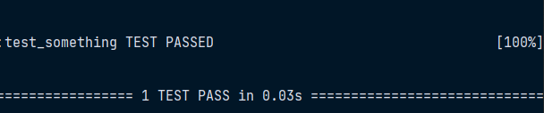
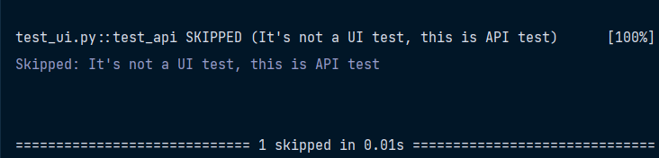

# <span style="font-family:Helvetica; font-size:2em;">Hooks</span>

## <span style="font-family:Helvetica; font-size:1em">Introduction to hooks</span>
Hooks are a key part of pytest's plugin system and are used by plugins and by pytest itself to extend the functionality of pytest. Hooks allow plugins to register custom code to be run at specific points during the execution of pytest, such as before and after tests are run, or when exceptions are raised.

In following example, the pytest_report_teststatus hook is used to customize the way that test results are reported:
```python
import pytest

@pytest.hookimpl
def pytest_report_teststatus(report):
    if report.when == "call":
        if report.outcome == "failed":
            return "TEST FAIL", "F", "TEST FAILED"
        elif report.outcome == "passed":
            return "TEST PASS", "P", "TEST PASSED"

def test_something():
    assert 1 + 1 == 2
```



In following example, the pytest_report_teststatus hook is used to customize tests.
If the test name is prefixed with `api` this test must be skipped.
```python
import pytest

def pytest_collection_modifyitems(session, config, items):
    skip_api_marker = pytest.mark.skip(reason="It's not a UI test, this is API test")

    for item in items:
        if "api" in item.name:
            item.add_marker(skip_api_marker)

def test_api():
    assert 1 + 1 == 2
```

You can read more about hooks in the official documentation, as well as useful information [here](https://paragkamble.medium.com/understanding-hooks-in-pytest-892e91edbdb7#:~:text=Hooks%20are%20a%20key%20part%20of%20pytest's%20plugin%20system%20and,or%20when%20exceptions%20are%20raised)
